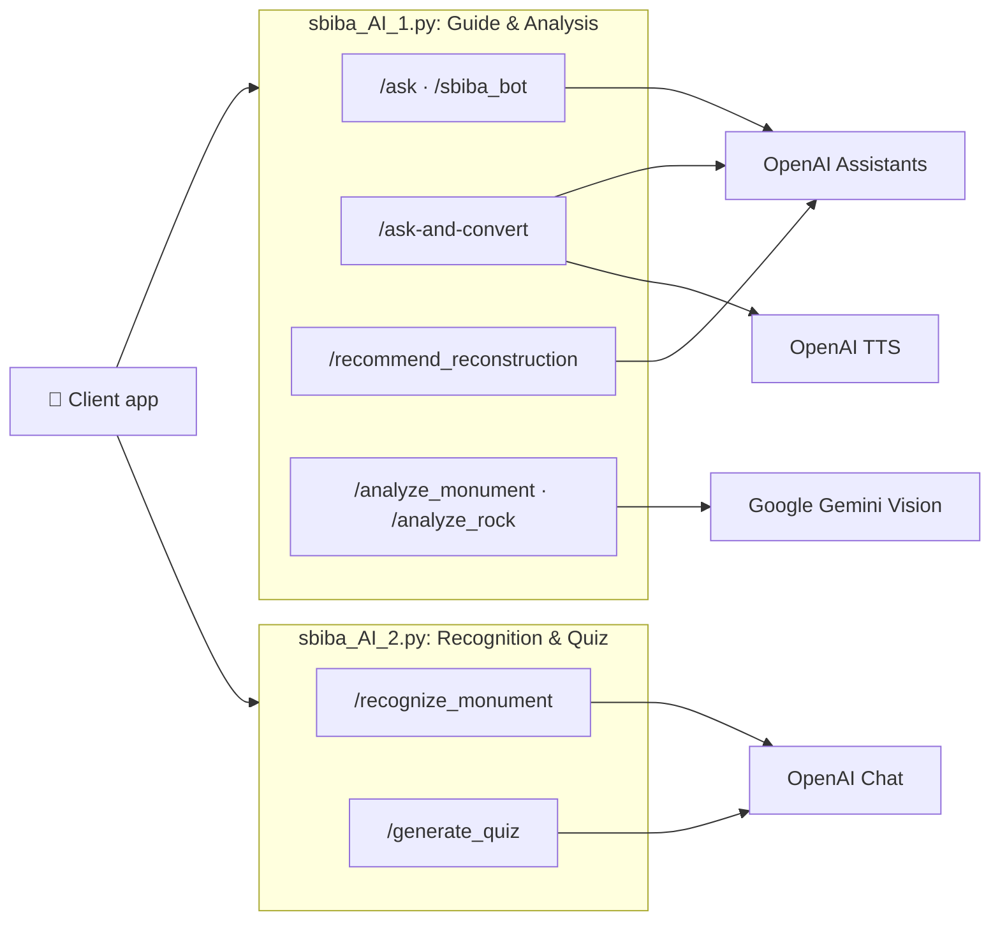

<div align="center">

# 🏛️ SbibaBack

**The AI backend for an interactive heritage guide to the ancient monuments of Sbiba, Tunisia.**

Ask a virtual guide · recognize monuments · analyze stones · plan restorations · play quizzes


</div>

---

## 📖 Table of Contents

- [Overview](#-overview)
- [Features](#-features)
- [Architecture](#-architecture)
- [Tech Stack](#-tech-stack)
- [Project Structure](#-project-structure)
- [Getting Started](#-getting-started)
- [Environment Variables](#-environment-variables)
- [API Reference](#-api-reference)

---

## 🌟 Overview

**Sbiba** (ancient *Sufes*) is a town in the Kasserine region of Tunisia with Roman-era remains, including an amphitheatre, a nymphaeum, and an aqueduct.

**SbibaBack** is the AI layer behind a digital guide to these sites. It exposes simple REST endpoints that:

- answer visitors' questions, adapted to their **age** and **language**
- read answers aloud with a narrator voice
- describe **monuments** and **stone samples** from photos
- recommend **restoration techniques** by comparing two stones
- recognize a monument from a description and generate a **quiz** about it

---

## ✨ Features

| | Feature | Powered by |
|---|---|---|
| 💬 | **Virtual guide**: answers about Sbiba's monuments, adapted to age and language | OpenAI Assistants |
| 🎧 | **Audio guide**: the same answer returned as an MP3 narration | OpenAI TTS (`tts-1`, voice *fable*) |
| 🏛️ | **Monument analysis**: architecture, materials, history, and erosion from a photo | Gemini 1.5 Flash (vision) |
| 🪨 | **Rock analysis**: color, texture, composition, erosion, and fractures from a photo | Gemini 1.5 Flash (vision) |
| 🧱 | **Restoration advisor**: checks if two stones are compatible and suggests a technique | OpenAI Assistants |
| 🔎 | **Monument recognition**: identifies which Sbiba monument a description matches | OpenAI Chat (`gpt-3.5-turbo`) |
| ❓ | **Quiz generator**: one multiple-choice question with an explanation | OpenAI Chat (`gpt-3.5-turbo`) |

---

## 🏗 Architecture



---

## 🛠 Tech Stack

| Purpose | Technology |
|---|---|
| Language | Python 3.9+ |
| Web framework | Flask |
| LLM / Assistants / TTS | OpenAI API |
| Vision | Google Gemini 1.5 Flash (REST) |
| Image processing | Pillow |
| HTTP | requests |
| Tunneling (optional) | pyngrok |

---

## 📂 Project Structure

```
SbibaBack/
├── sbiba_AI_1.py   # Guide chat, audio guide, restoration advisor, image analysis
├── sbiba_AI_2.py   # Monument recognition & quiz generation
└── README.md
```

---

## 🚀 Getting Started

### 1. Clone

```bash
git clone https://github.com/achreflajmi/SbibaBack.git
cd SbibaBack
```

### 2. Install dependencies

The two services use different generations of the OpenAI SDK, so give each one its own virtual environment:

```bash
# Service 1: guide & analysis (OpenAI SDK v1)
python -m venv .venv1
source .venv1/bin/activate          # Windows: .venv1\Scripts\activate
pip install flask "openai>=1.0" requests pillow

# Service 2: recognition & quiz (legacy OpenAI SDK)
python -m venv .venv2
source .venv2/bin/activate          # Windows: .venv2\Scripts\activate
pip install flask "openai==0.28" pyngrok
```

### 3. Set environment variables

See [Environment Variables](#-environment-variables).

### 4. Run

```bash
python sbiba_AI_1.py   # → http://localhost:5000
python sbiba_AI_2.py   # → http://localhost:5000
```

> **Note**
> Both services listen on port **5000** by default. Run one at a time, or change the port in one of the files to run them together.

---

## 🔑 Environment Variables

| Variable | Used by | Description |
|---|---|---|
| `OPENAI_API_KEY` | both | Your OpenAI API key |
| `GEMINI_API_KEY` | service 1 | Google AI Studio API key |
| `ASSISTANT_ID_1` | service 1 | Assistant for `/ask` and `/ask-and-convert` |
| `ASSISTANT_ID_2` | service 1 | Assistant for `/sbiba_bot` |
| `ASSISTANT_ID_3` | service 1 | Assistant for `/recommend_reconstruction` |
| `ASSISTANT_ID_MONUMENT` | service 2 | Reserved for monument recognition |
| `ASSISTANT_ID_QUIZ` | service 2 | Reserved for quiz generation |

```bash
export OPENAI_API_KEY="sk-..."
export GEMINI_API_KEY="..."
export ASSISTANT_ID_1="asst_..."
# ...
```

> **Tip**
> Give the assistants the Sbiba documentation (PDFs) through OpenAI file search so their answers rely on real sources.

---

## 📡 API Reference

### Service 1: `sbiba_AI_1.py`

<details>
<summary><code>POST /ask</code> and <code>POST /sbiba_bot</code>: ask the virtual guide</summary>

```json
// Request
{ "message": "Tell me about the amphitheatre", "age": 10, "language": "French" }

// Response
{ "response": "..." }
```

`age` defaults to `25` and `language` defaults to `English`.
</details>

<details>
<summary><code>POST /ask-and-convert</code>: audio guide (returns MP3)</summary>

Uses the same body as `/ask`. The response is an `audio/mp3` file named `output.mp3`.
</details>

<details>
<summary><code>POST /recommend_reconstruction</code>: restoration advisor</summary>

```json
// Request
{ "rock_1_description": "...", "rock_2_description": "..." }

// Response
{ "reconstruction_recommendation": "..." }
```
</details>

<details>
<summary><code>POST /analyze_monument</code>: describe a monument from a photo</summary>

Send `multipart/form-data` with an `image` field.

```json
{ "monument_description": "..." }
```
</details>

<details>
<summary><code>POST /analyze_rock</code>: describe a stone sample from a photo</summary>

Send `multipart/form-data` with an `image` field.

```json
{ "rock_description": "..." }
```
</details>

### Service 2: `sbiba_AI_2.py`

<details>
<summary><code>POST /recognize_monument</code>: identify a monument</summary>

```json
// Request
{ "description": "A large oval stone structure with tiered seating" }

// Response
{ "monument_name": "Amphitheatre" }
```
</details>

<details>
<summary><code>POST /generate_quiz</code>: generate a quiz question</summary>

```json
// Request
{ "monument_name": "Amphitheatre of Sbiba" }

// Response
{ "quiz": "Question: ...\nA) ...\nB) ...\nC) ...\nD) ...\n\nCorrect Answer: B\n\nExplanation: ..." }
```
</details>

### Quick test

```bash
curl -X POST http://localhost:5000/ask \
  -H "Content-Type: application/json" \
  -d '{"message": "What is the nymphaeum?", "age": 12, "language": "English"}'

curl -X POST http://localhost:5000/analyze_monument -F "image=@photo.jpg"
```

---

<div align="center">

Made with ❤️ to preserve and share the heritage of Sbiba.

</div>
